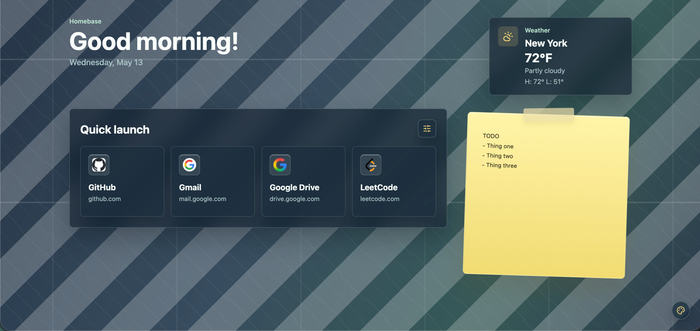
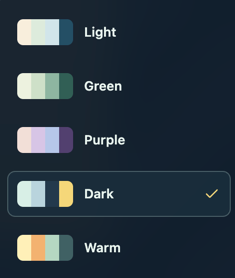

<h1>
  
  Homebase
</h1>

> [!NOTE]
> A clean new tab page that keeps you focused.

Homebase is a custom new tab extension with weather, quick links, notes, and beautiful themes.



## Features

### Quick launch shortcuts

Keep your most-used sites one click away.

### Weather at a glance

See the current temperature, condition, and daily high/low right from your new tab.

### Built-in notepad

Write down any thoughts, reminders, or ideas without opening another app.

### Multiple themes

Choose from clean visual themes based on your preferences.

### Minimal and distraction-free

No unnecessary noise, just the things you actually need.

## Themes

Homebase includes several themes to fit everyone's style.



Available themes:

- Light
- Green
- Purple
- Dark
- Warm

## Why Homebase?

Most new tab pages are either empty or overloaded. Homebase is designed to be a balance, where it can be both useful and quiet enough.

Homebase is designed for:

- Easy access to common tools
- Not too cluttered
- Easy to personalize
- Easy to get used to

## Installation

1. Clone this repository:

```bash
git clone https://github.com/aunncodes/homebase.git
```

2. Install any dependencies and build the project

```bash
npm install
npm run build
```

3. Run the extension:

For Chrome or Chromium browsers:

```text
chrome://extensions
```

Enable **Developer mode**.

Click **Load unpacked**.

Select `path-to-your-project/extension/chrome`.

Open a new tab and enjoy your new homebase.

For Firefox:

```text
about://debugging
```

Click on This Firefox

Press Load Temporary Add-on...

Select `path-to-your-project/extension/firefox.xpi`.

## Customization

Homebase has many different themes you can select from.

## Contributing

Contributions are welcome. Feel free to open an issue or submit a pull request with improvements, bug fixes, or new ideas.
